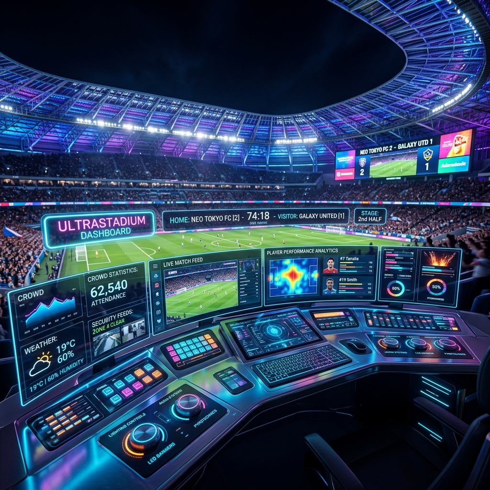
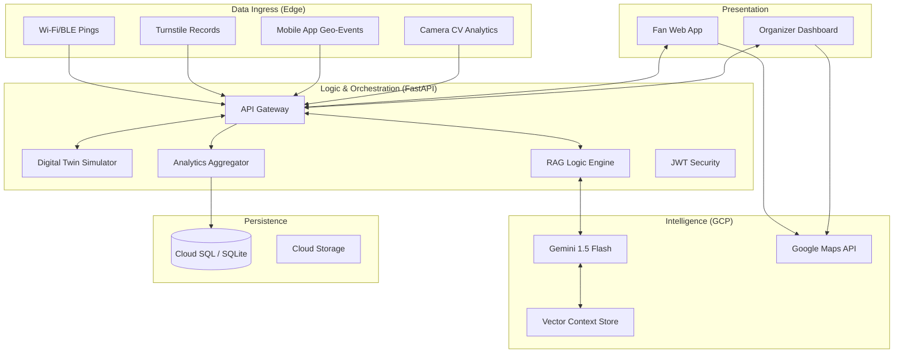
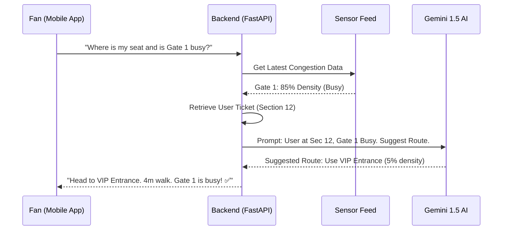
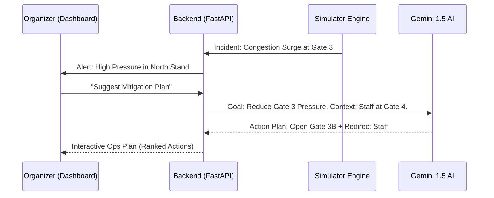
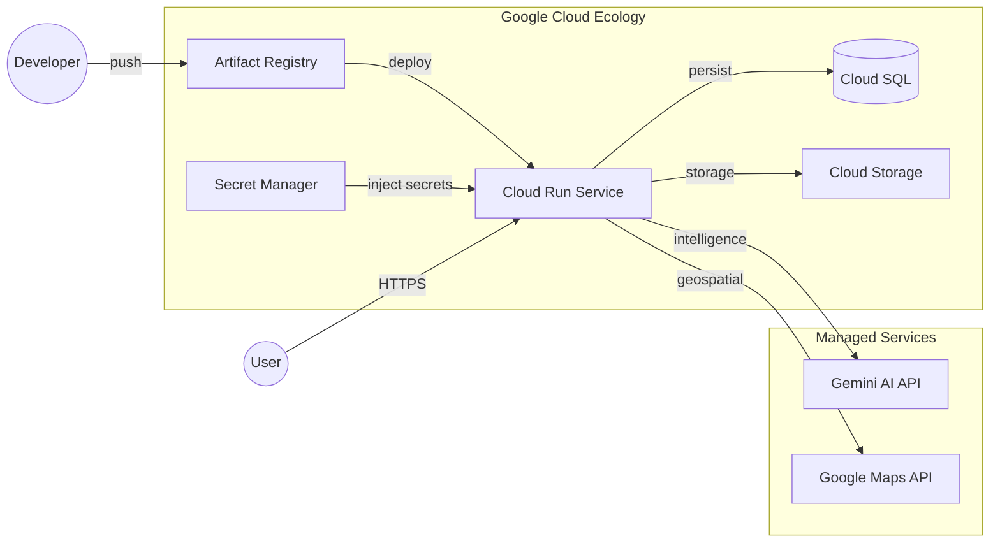

# 🏟️ EventFlow: AI-Native Physical Event Orchestration

**EventFlow** is the operating system for physical events. By fusing real-time sensor telemetry with multi-modal AI, we transform chaotic crowd logistics into choreographed, high-engagement experiences. Designed for high-stakes championships and massive concerts, EventFlow reduces venue friction and provides agentic assistance through a unified, intelligence-first interface.

---

## 🎯 Design Philosophy & UX

### Intelligence-First Architecture
Traditional event management tools bury mission-critical data in nested menus and static dashboards. EventFlow flips this paradigm by placing a **conversational, agentic concierge** at the heart of the experience. Information isn't just displayed; it is *orchestrated*.

### The "Event Night" Aesthetic
- **Visual Rationale**: Our UI employs a high-contrast dark-mode palette with vivid neon accents—**Electric Blue** for movement, **Royal Purple** for intelligence, and **Safety Red** for incidents. 
- **Environmental Adaptive**: This glassmorphism design ensures readability in high-glare stadium environments while mirroring the modern, high-tech energy of professional sports and concerts.

---

## 🏗️ Technical Architecture

EventFlow uses a multi-layered architecture designed for real-time sensor fusion and predictive reasoning.

---

## 🔄 Component Interactions

### 🤖 AI Concierge Flow (Fan Side)
When a fan interacts with the AI Concierge, the system performs "Agentic Grounding" to provide live-aware navigation advice.

### 🏆 Operational Triage (Manager Side)
EventFlow helps venue managers manage incidents by synthesizing simulator projections with live sensor data.

---

## ☁️ Deployment Architecture (Google Cloud)

EventFlow is optimized for native deployment on Google Cloud Platform, leveraging serverless scale and advanced security.

---

## 📋 Evaluation Focus Areas

### 🛡️ Code Quality & Security
- **Security Headers**: Custom middleware enforces HSTS, CSP-lite, and frame protection.
- **X-Process-Time**: Every API response includes efficiency audit headers.
- **Authentication**: Robust JWT structure with bcrypt hashing.

### 🧪 Testing
- **Automated Validation**: Pytest suite validated core API health and auth logic.
- **Mock Integrity**: Designed for offline validation with Gemini service mocks.

### ♿ Accessibility
- **ARIA Standards**: Sidebar and forms are fully accessible via screen-readers and keyboard navigation.

---

## 🐳 Getting Started

1. **Clone & Setup**: Install dependencies for both `frontend` and `backend`.
2. **Environment**: Add `GOOGLE_API_KEY` and `VITE_GOOGLE_MAPS_API_KEY`.
3. **Run**: Use `python main.py` in the backend and `npm run dev` in the frontend.

*Built with ❤️ for the ultimate event experience.*
